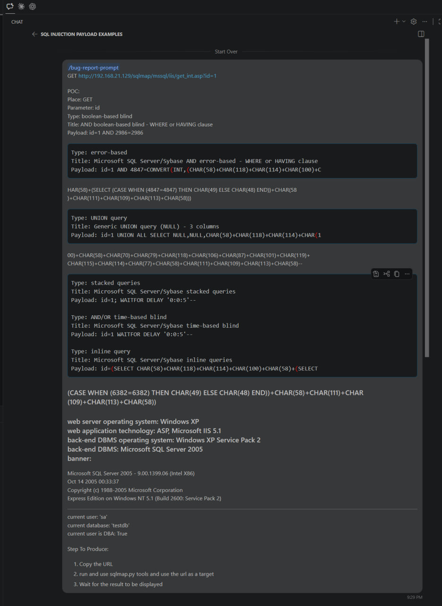
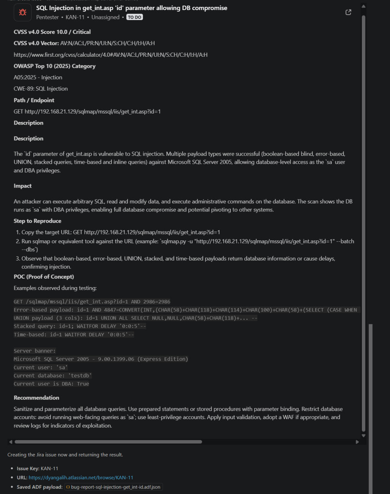
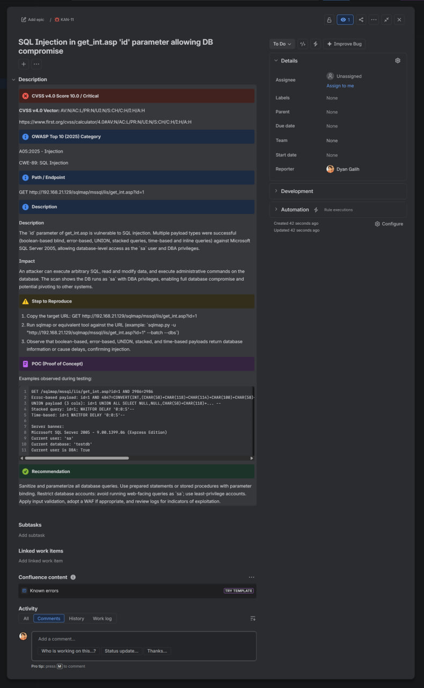

<p align="center">
  
</p>

# 👻 BugWisp

**From raw proof to polished reports.**

BugWisp is a CLI that installs the `bug-report-prompt` as a native skill for 34+ AI coding agents, including Claude Code, Cursor, GitHub Copilot, Codex, Gemini, and OpenCode.

The skill collects missing vulnerability details, generates optional report content from evidence, renders Markdown or Atlassian Document Format (ADF), and can create Jira issues through Atlassian Rovo MCP.

## ✨ Why Use It?

- Produce consistent reports with mandatory security fields.
- Convert raw requests, responses, logs, and screenshots into structured findings.
- Generate human-readable Markdown and Jira-ready ADF from shared evidence.
- Create Jira issues through MCP without manually copying JSON payloads.
- Preserve local Markdown and ADF files when Jira delivery fails.
- Install the same reporting workflow across many AI coding agents.

## 🚀 Quick Start

1. Install dependencies:

   ```bash
   npm install
   ```

2. Create your local configuration:

   ```bash
   cp .env.example .env
   ```

3. Edit `.env` with your Jira project and reporting preferences.

4. Install the skill:

   ```bash
   node index.js init
   ```

5. Select one or more agents, then invoke the installed skill:

   ```text
   /bug-report-prompt I found an XSS vulnerability in the login form at /auth/login...
   ```

The skill asks for missing mandatory fields as free text. Optional fields are generated from the supplied evidence unless you provide them explicitly.

## 📝 Raw Finding Input

For the shortest intake, use [`templates/raw/finding-input-simple.md`](templates/raw/finding-input-simple.md):

```bash
cp templates/raw/finding-input-simple.md raw-finding.md
```

It only asks for:

1. URL and action, such as `GET https://target.example/path`
2. Steps to reproduce
3. POC or the text `Screenshot will be provided`

Use [`templates/raw/finding-input.md`](templates/raw/finding-input.md) when you want to provide complete requests, responses, classifications, screenshot context, and other optional details:

```bash
cp templates/raw/finding-input.md raw-finding.md
```

Then ask the installed skill to process the file:

```text
/bug-report-prompt Generate a report from raw-finding.md
```

The detailed template also provides optional fields for a suggested title, CVSS, OWASP category, CWE, description, impact, expected result, recommendation, references, and notes. Leave unknown optional fields blank; the skill will derive supported values from the evidence or use `[N/A]`.

`Screenshot will be provided` is a placeholder, not evidence. The skill will request the screenshot or a description of what it proves before finalizing the report.

Before sharing or committing raw finding files, redact credentials, session cookies, API keys, personal data, and other secrets.

## ⚙️ Configuration

| Variable | Purpose | Example |
| --- | --- | --- |
| `JIRA_BOARD_URL` | Jira board URL | `https://your-org.atlassian.net/jira/software/projects/APP/boards/1` |
| `JIRA_BOARD_ID` | Jira board identifier | `1` |
| `JIRA_PROJECT_KEY` | Jira project key | `APP` |
| `JIRA_PARENT_ISSUE` | Optional parent issue | `APP-100` |
| `JIRA_CLOUD_ID` | Atlassian site identifier | `00000000-0000-0000-0000-000000000000` |
| `REPORT_FORMAT` | Delivery format: `markdown` or `adf` | `markdown` |
| `GENERATE_MARKDOWN_COPY` | Save Markdown locally when using Jira/ADF | `true` |
| `REPORT_TEMPLATE_PATH` | Markdown template | `templates/markdown/bug-template.md` |
| `ADF_TEMPLATE_PATH` | ADF JSON template | `templates/adf/bug-template.json` |

`.env` is gitignored. Never commit real project details, tokens, or credentials.

### Get the Jira Cloud ID

Replace `[workspace]` with your Atlassian workspace name and open:

```text
https://[workspace].atlassian.net/_edge/tenant_info
```

Raw HTTP request:

```http
GET /_edge/tenant_info HTTP/1.1
Host: [workspace].atlassian.net
Accept: application/json
```

Terminal equivalent:

```bash
curl --request GET \
  --url "https://[workspace].atlassian.net/_edge/tenant_info" \
  --header "Accept: application/json"
```

Example response:

```json
{
  "cloudId": "00000000-0000-0000-0000-000000000000",
  "tenantId": "00000000-0000-0000-0000-000000000000",
  "realm": "prod"
}
```

The UUID above is illustrative. Copy the `cloudId` returned by your workspace into `.env`.

### Configure Jira MCP in VS Code

Add the Atlassian Rovo MCP server to `.vscode/mcp.json`:

```json
{
  "servers": {
    "jira": {
      "type": "http",
      "url": "https://mcp.atlassian.com/v1/mcp",
      "gallery": "https://api.mcp.github.com",
      "version": "1.1.3"
    }
  },
  "inputs": []
}
```

Start the `jira` server and complete Atlassian OAuth authorization in your browser. The `gallery` and `version` fields are GitHub MCP Registry metadata; other MCP clients use different configuration schemas and locations.

If the default endpoint has authentication or cached-client issues, current Atlassian IDE guidance recommends:

```text
https://mcp.atlassian.com/v1/mcp/authv2
```

## 🔄 Reporting Workflow

1. Provide the raw vulnerability details.

   

2. Review the structured report generated from the evidence.

   

3. Post the completed report to Jira.

   

The generated report contains: CVSS Score, OWASP Top 10 Category, Affected Asset or Endpoint, Description, Steps to Reproduce, Evidence or POC, and Recommendation.

## 📂 Report Output

Output files are separated by format:

```text
reporting/output/
├── markdown/
│   └── vulnerability-title.md
└── adf/
    └── vulnerability-title.json
```

- `REPORT_FORMAT=markdown` saves the completed report under `reporting/output/markdown/`.
- `REPORT_FORMAT=adf` creates the Jira issue through MCP.
- `GENERATE_MARKDOWN_COPY=true` also saves a local Markdown copy after successful Jira delivery.
- If Jira MCP fails after its allowed retry, the skill saves matching Markdown and ADF fallback files automatically.
- Existing reports are not overwritten; a numeric suffix is added when needed.

## 🤖 Supported Agents

| Agent type | Installed format | Result |
| --- | --- | --- |
| OpenCode | `.opencode/commands/*.md` | `/bug-report-prompt` command |
| Claude Code | `.claude/skills/<name>/SKILL.md` | `/bug-report-prompt` command |
| Cursor | `.cursor/skills/*.md` | Auto-applied skill |
| GitHub Copilot | `.github/skills/<name>/SKILL.md` | `@copilot` prompt |
| Gemini | `.gemini/commands/*.toml` | TOML command |
| Goose | `.goose/recipes/*.yaml` | YAML recipe |
| Codex, Zed, agy | `.agents/skills/<name>/SKILL.md` | Native skill |
| 27+ additional agents | Agent-specific format | Native command or skill |

## 🗺️ Roadmap

The roadmap is organized around a gradual move from individual finding generation to complete engagement reporting and multi-platform publishing.

### Stage 1 — Individual Findings (Current)

- Collect mandatory vulnerability details and derive optional content from evidence.
- Generate consistent Markdown and Jira ADF reports.
- Create Jira issues through Atlassian Rovo MCP.
- Preserve local Markdown and ADF artifacts when Jira delivery fails.
- Install the workflow across supported AI coding agents.

### Stage 2 — Engagement Reports and Publishing (Next)

- Aggregate all findings into a final engagement report with two views:
  - an executive summary for management, including risk posture, severity distribution, business impact, and prioritized actions;
  - a technical report for engineering, including complete findings, evidence, reproduction steps, and remediation guidance.
- Introduce a canonical, versioned finding schema so Markdown, ADF, HTML, PDF, and external publishers render the same source data.
- Add pluggable MCP or API publishers for Jira, GitHub Issues, Outline, Confluence, and other reporting platforms.
- Upload POC screenshots and supporting evidence after issue creation:
  - use a platform MCP tool when attachment upload is available;
  - use the platform API as a fallback;
  - validate file type and size, redact sensitive data, and require an explicit target issue or document.
- Import findings from common security-tool formats such as SARIF, Burp Suite, OWASP ZAP, and structured JSON.
- Add quality gates for missing evidence, unresolved placeholders, invalid CVSS data, duplicate findings, and accidental secret exposure.
- Add branded report templates and export options for HTML and PDF delivery.

Jira screenshot upload is technically feasible through the [Jira Cloud attachment API](https://developer.atlassian.com/cloud/jira/platform/rest/v3/api-group-issue-attachments/). Native MCP upload remains dependent on the tools exposed by the connected MCP server.

### Stage 3 — Multi-Project and Program Reporting (Exploratory)

- Introduce explicit organization, client, engagement, and project boundaries.
- Keep templates, credentials, evidence, and outputs isolated per engagement.
- Track finding lifecycle across draft, published, accepted-risk, remediated, and retest states.
- Synchronize status changes with connected platforms without duplicating findings.
- Generate cross-project dashboards for recurring weaknesses, severity trends, remediation time, and control coverage.
- Add finding fingerprinting and deduplication across scans, retests, and projects.
- Maintain an audit trail of report versions, publication attempts, evidence changes, and external references.

Multi-project support should follow the canonical finding schema and publisher architecture. Building it earlier would couple project management concerns to the current single-finding workflow.

## 🗂️ Project Structure

```text
.
├── index.js                    CLI entry point
 ├── commands/init.js            Interactive agent selection
 ├── lib/
 │   ├── installer.js            Agent-specific skill installer
 ├── prompts/
│   └── bug-report-prompt.md    Reporting workflow
├── templates/
│   ├── raw/                    Simple and detailed raw input templates
│   ├── markdown/               Markdown report templates
│   └── adf/                    Jira ADF template
├── reporting/
│   ├── archived/               Archived reference findings
│   └── output/
│       ├── markdown/           Generated Markdown reports
│       └── adf/                Generated ADF payloads
├── docs/images/                README screenshots
├── config/                     Security classification mappings
└── .env.example               Configuration template
```

## 🧪 Development

Run the test suite:

```bash
npm test
```
